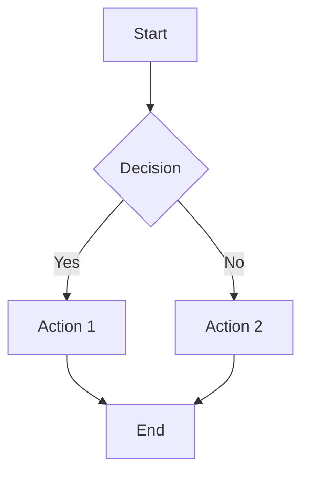
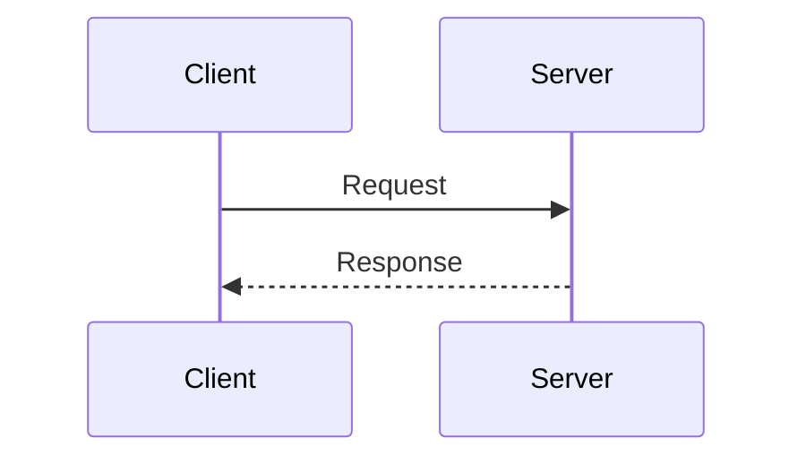
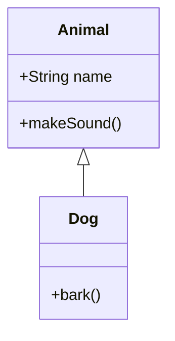
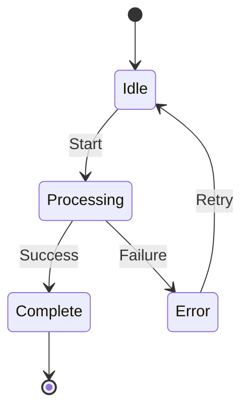
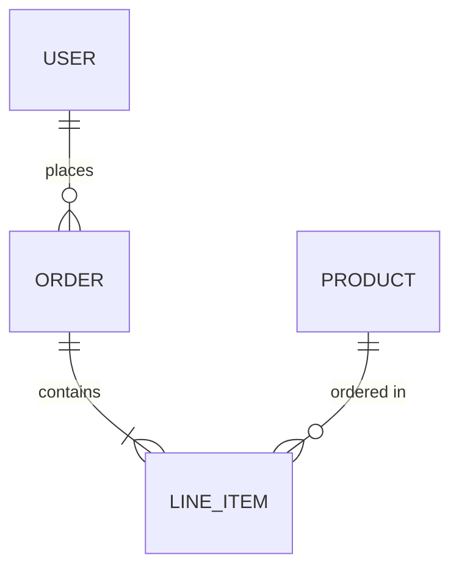

# Mermaid Cookbook

Render mermaid diagrams and upload to Google Drive for insertion into Docs.

## Commands Reference

```bash
# Render to local file
uv run core/skills/gsuite/tools/mermaid.py render "graph TD; A-->B" -o diagram.png

# Render from file
uv run core/skills/gsuite/tools/mermaid.py render @flowchart.mmd -o output.png

# Render as SVG
uv run core/skills/gsuite/tools/mermaid.py render "graph TD; A-->B" -f svg

# Upload to Drive (private)
uv run core/skills/gsuite/tools/mermaid.py upload "graph TD; A-->B" --name architecture.png

# Upload to specific folder
uv run core/skills/gsuite/tools/mermaid.py upload @diagram.mmd --folder <folder_id> --name flow.png

# Generate URL only (no upload)
uv run core/skills/gsuite/tools/mermaid.py url "graph TD; A-->B"
```

## Input Methods

**Inline code:**
```bash
mermaid.py render "graph TD; A-->B; B-->C"
```

**From file (prefix with @):**
```bash
mermaid.py render @/tmp/diagram.mmd
```

## Supported Formats

| Format | MIME Type | Use Case |
|--------|-----------|----------|
| `png` | image/png | Google Docs insertion, general use |
| `svg` | image/svg+xml | Scalable, editable in design tools |

## Mermaid Syntax Quick Reference

**Flowchart:**


**Sequence Diagram:**


**Class Diagram:**


**State Diagram:**


**Entity Relationship:**


## Workflow: Insert Diagram into Google Doc

**Step 1: Render and upload to Drive**
```bash
uv run mermaid.py upload @diagram.mmd --name architecture.png --json
# Returns: {"file_id": "abc123", ...}
```

**Step 2: Insert into Doc via --extra**
```bash
# See cookbook/docs.md for insertInlineImage details
uv run docs.py write <doc_id> "" --extra '{
  "requests": [{
    "insertInlineImage": {
      "uri": "https://drive.google.com/uc?id=<file_id>&export=download",
      "location": {"index": 1}
    }
  }]
}'
```

## Background Colors

Default: `white`

Common options:
- `white` - Standard white background
- `transparent` - Transparent (PNG only)
- `!white` - Mermaid.ink notation for hex colors (e.g., `!F5F5F5`)

```bash
mermaid.py render "graph TD; A-->B" --background transparent
```

## Error Handling

| Error | Cause | Solution |
|-------|-------|----------|
| HTTP 400 | Invalid mermaid syntax | Check syntax at mermaid.live |
| Network Error | mermaid.ink unreachable | Retry or check connectivity |
| API Error | Drive upload failed | Check auth, permissions |

## Tips

- Use `--json` output for scripting and chaining with other tools
- PNG format recommended for Google Docs insertion
- Large diagrams may hit mermaid.ink size limits - simplify or split
- Files uploaded via `upload` are always private to the account owner
